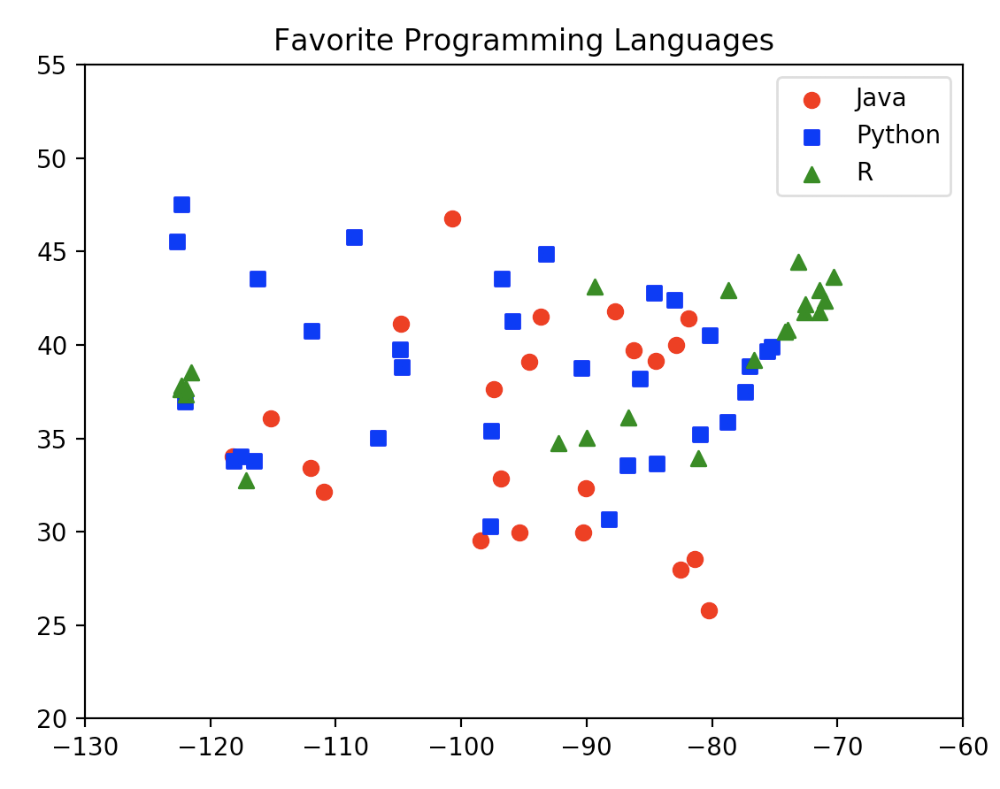
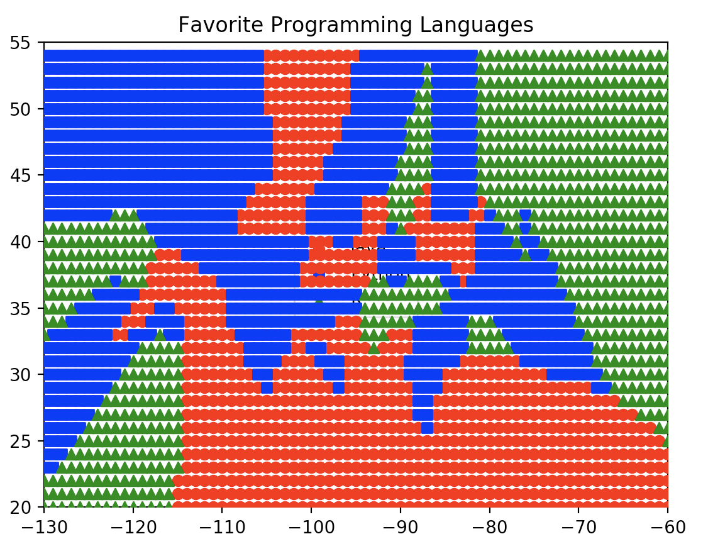
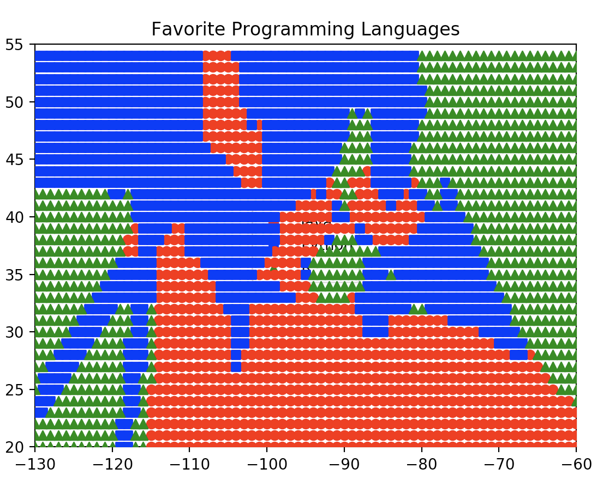
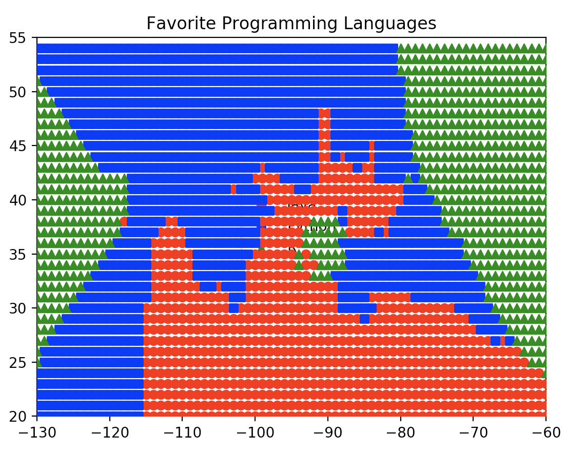

# Lab 5
Contents
```
-data.py
-knn.py (uses custom classifier function)
-plots.py
-knn2.py (uses KNeighborsClassifier from sklearn)
-plots2.py

```

# Part 1
Output from running knn.py
```
$ python3 knn.py
1 neighbor[s]: 40 correct out of 75
3 neighbor[s]: 44 correct out of 75
5 neighbor[s]: 41 correct out of 75
7 neighbor[s]: 35 correct out of 75
```

Output from running knn2.py
```
$ python3 knn2.py
1 neighbor[s]: 40 correct out of 75
3 neighbor[s]: 44 correct out of 75
5 neighbor[s]: 37 correct out of 75
7 neighbor[s]: 36 correct out of 75
```

The KNeighborsClassifier is slightly more accurate than the custom one


# Part II
## Plot from plots.py
Plot of Cities (Training Data)


K = 1


K = 3


K = 5

